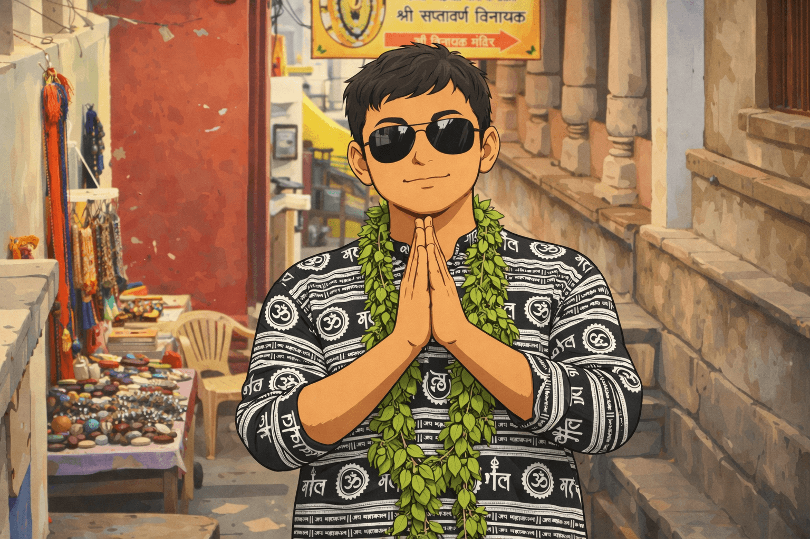

# About Me

{: .profile-photo }

## 👋 Hi, I'm Abhishek Sahu

A positive-minded engineer who believes that a good solution is all about **understanding trade-offs and making thoughtful decisions**. I enjoy diving deep into problems, exploring them from multiple dimensions, and arriving at solutions that are both practical and scalable.

I’m a curious thinker at heart — always questioning, always exploring, and always looking for better ways to build and improve. Whether it’s system design or learning a new domain, I approach everything with a mindset of **continuous analysis and growth**.

**Discipline** plays a big role in my journey. I focus on setting **achievable, consistent goals** and improving a little every day — because real progress is built over time, not overnight.

Rather than chasing **distant long-term plans**, I believe in a more adaptive vision — one that evolves with changing situations, learns from experience, and keeps moving forward with purpose.

> **“Even the greatest problems don’t need brilliance to solve — just consistency, discipline, and patience applied every single day.”**

---

## 🤝 Let’s Connect

I’m always open to meaningful conversations around **technology, system design, and ideas that create impact**. Whether it’s discussing scalable architectures, sharing learnings, collaborating on projects, or just exchanging perspectives — feel free to reach out.

If something I’ve built or written resonates with you, that’s already a great starting point for a conversation.

:material-gmail: [abhisheksahu.cse@gmail.com](mailto:abhisheksahu.cse@gmail.com)

:material-linkedin: [abhisheksahu-iitk](https://www.linkedin.com/in/abhisheksahu-iitk)

---

## 🎓 Education Journey

If I had to describe my education, I wouldn’t call it just a list of degrees — it’s a story of **discipline, exploration, and continuous evolution**.

It all started during my **Matriculation**, where I first realized that I could actually do well in academics. More importantly, it taught me the value of **taking small, consistent steps** — the foundation of discipline that still drives me today.

During my **Intermediate**, things changed. I became more serious, more focused. I pushed myself through a vast syllabus with hard work and persistence, experimenting with different ways of learning. This phase was where I truly understood what it means to **commit fully to something**.

Then came **B.Tech** — not just a degree, but a transformation phase. Being in a vibrant and happening college environment, I didn’t limit myself to academics. I learned life skills — from communication and confidence to participating in events, sports, and competitions. Alongside all of this, I consistently performed well academically, even becoming a **topper**.

Qualifying **GATE** and getting into **IIT Kanpur** was a defining moment. This place didn’t just educate me — it **refined and matured me** as a Computer Science professional.

Initially, I immersed myself in a wide range of activities — extracurriculars, building connections, making friends, and of course, playing a lot of cricket (where I was fondly known as *“Sahu Bhai”* 😄). Despite juggling so much, I maintained strong academic performance — learning how to **manage multiple priorities efficiently**.

At IIT, my curiosity reached another level. I explored different dimensions of technology, worked across research areas, and constantly pushed myself to learn beyond the classroom. Along the way, I traveled, experienced life, and grew into a more energetic and well-rounded individual.

For me, education was never confined to textbooks or classrooms. It never restricted me — instead, it gave me the confidence to step outside my domain.

**Below is my report card** 🤣

| Year      | Degree / Certificate             | Institute                     | Score     |
| --------- | -------------------------------- | ----------------------------- | --------- |
| 2021–2023 | M.Tech, Computer Science & Engg. | IIT Kanpur                    | 9.0 / 10  |
| 2017–2021 | B.Tech, Computer Science & Engg. | BPUT                          | 8.99 / 10 |
| 2015–2017 | CBSE (Class XII)                 | Kendriya Vidyalaya, Berhampur | 87.8%     |
| 2015      | CBSE (Class X)                   | Kendriya Vidyalaya, Berhampur | 9.6 CGPA  |

---

## 💼 Working Experience

### Software Engineer — Oracle India Pvt. Ltd. (Aug 2023 – Present)

* Architected and implemented a **scalable microservice ecosystem**, improving performance by 25%
* Built responsive frontend using **TypeScript and Oracle JET**, increasing user productivity by 30%
* Integrated microservices with large-scale ERP systems, reducing latency by 20%
* Improved system stability and reduced downtime by 15%
* Focused on **clean architecture, scalability, and reliability across full-stack systems**

---

## 🛠️ Technical Skills

I consider myself a **fast and adaptable learner**, someone who never says no to a new technology. For me, it’s not about memorizing syntax — it’s about **understanding how things actually work under the hood**.

I believe real strength in engineering comes from grasping **concepts, patterns, and system behavior**, rather than just language-specific details. That’s why I focus on building a strong foundation that allows me to move across technologies with ease.

Throughout my journey, whenever I encounter something new, my approach is simple:
**explore → read documentation → build a POC → get hands-on experience.**

I enjoy getting my hands dirty, experimenting, and learning by doing. This mindset has helped me quickly adapt to different tools, frameworks, and domains without hesitation.

I may not claim to memorize every syntax, but I take pride in my ability to **learn, adapt, and deliver across technologies efficiently**.

Below are some of the technologies I’ve worked with, but this list is always evolving as I continue to explore and learn new things:

| Category   | Technologies                                              |
|------------|-----------------------------------------------------------|
| Languages  | C, Java, Python, JavaScript, TypeScript, Ruby             |
| Frameworks | Spring Boot, FastAPI, Rails, Micronaut, React, Oracle JET |
| Databases  | MySQL, MongoDB, Elasticsearch, Oracle Sql                 |
| CICD       | Jenkins, Kubernetes, Electric Commander, Docker           |
| Cloud      | Oracle Cloud                                              |

---

## 🌱 Beyond Work

Outside of engineering, I like to keep life balanced and active:

* 🏏 Playing cricket - Don't ask me about my batting average, but I can definitely hold my own on the field! 😄
* 🎧 Music and audiobooks - Always have a playlist ready for coding sessions or relaxation.

  

    

      

        
      

      

        
      

      

        
      

    

  

